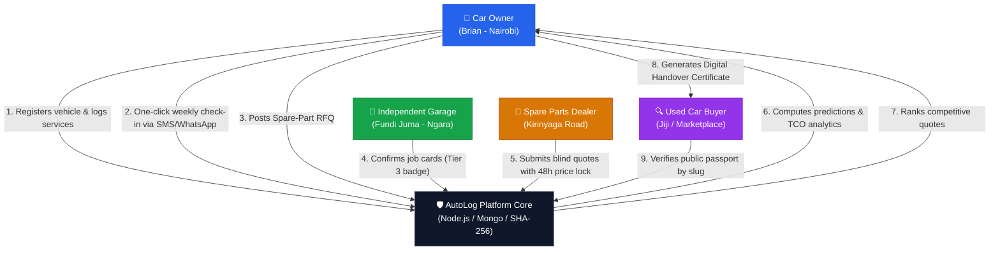
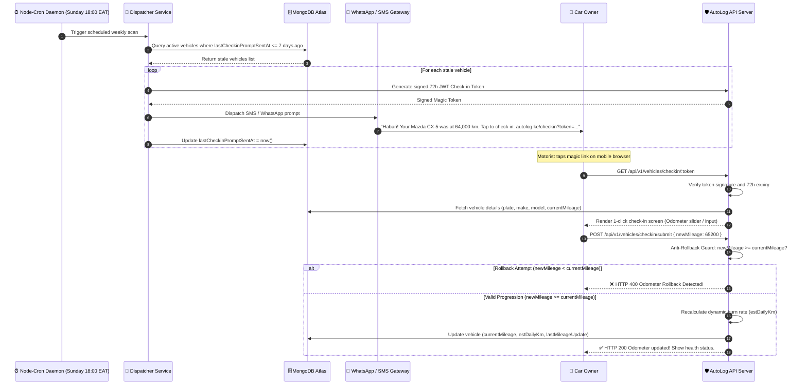
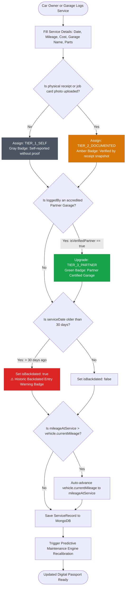
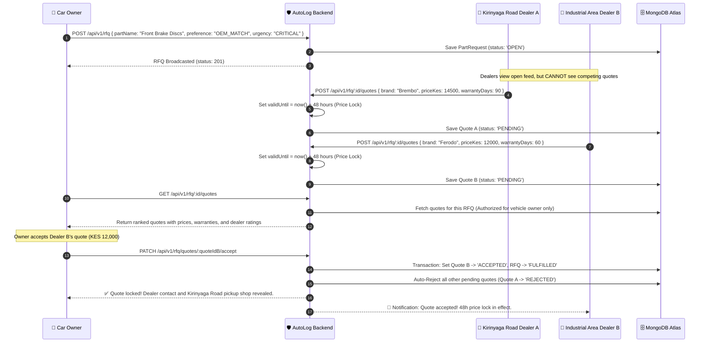
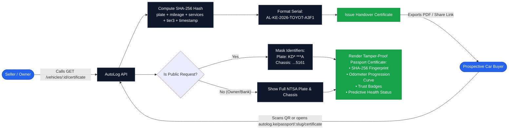
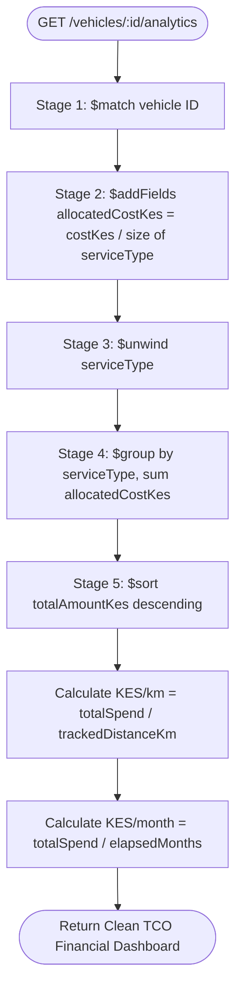

# 🔄 App Flows & System Architecture Workflows — AutoLog KE

This document maps out the **complete end-to-end user journeys, sequence diagrams, state machines, and data synchronization flows** across the AutoLog KE platform.

---

## 1. High-Level Multi-Stakeholder Ecosystem

AutoLog KE connects five key automotive stakeholders in Kenya:

---

## 2. Journey 1: Weekly Magic Check-in & Sunday Dispatcher Loop

This flow eliminates motorist laziness by removing app installations and passwords.

---

## 3. Journey 2: 3-Tier Service Logging & Anti-Fraud Verification

This workflow handles the transition from informal fundis with paper receipts to verified digital records.

### 3.1 Asynchronous Receipt Attachment & Tier 2 Upgrade Loop (`PATCH /services/:id/receipt`)
When a motorist logs a roadside maintenance record in a hurry, it enters the ledger as `TIER_1_SELF` (Gray Badge). Once at home or upon finding the physical paper invoice:
1. Owner/logger calls `PATCH /api/v1/services/:id/receipt` with `{ receiptUrl: "https://..." }`.
2. Multi-tenant access guard ensures only the vehicle owner, recording garage, or admin can modify the record.
3. If current status is `TIER_1_SELF`, it automatically upgrades to `TIER_2_DOCUMENTED` (Amber Badge).
4. If already `TIER_3_PARTNER`, the high-trust partner status is preserved while storing the receipt photo URL.

---

## 4. Journey 3: Kirinyaga Road Spare Parts RFQ Blind-Bidding

This flow eliminates price fixing, broker commissions, and counterfeit substitutions.

---

## 5. Journey 4: Digital Handover Certificate & Used Car Buyer Verification

How a buyer verifies vehicle authenticity before wiring money on M-Pesa.

---

## 6. Journey 5: Total Cost of Ownership (TCO) Proportional Aggregation

How multi-category invoices are parsed without mathematical double counting.

