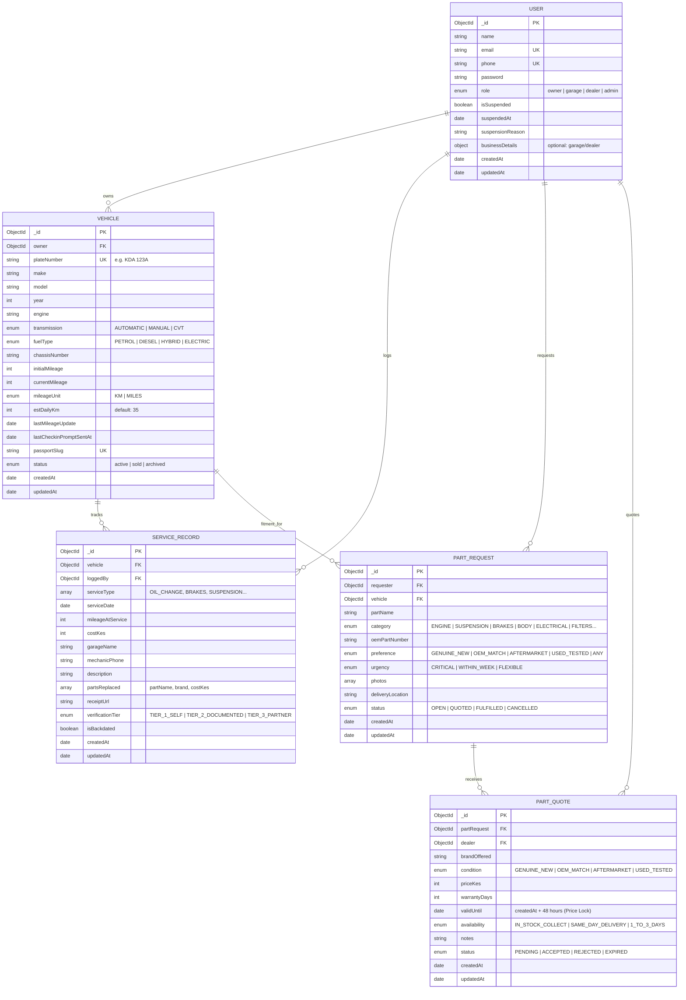

# 🗄️ Database Schema & Background Jobs Architecture — AutoLog KE

This document details the **MongoDB schema specifications, Entity-Relationship Diagram (ERD), indexing strategy, aggregation pipelines, and scheduled background daemons** driving AutoLog KE.

---

## 1. Entity-Relationship Diagram (ERD)



---

## 2. Model Specifications & Schema Enforcement

### 2.1 `User`
- **Unique Indexes:** `email` (lowercase, trimmed), `phone` (Kenyan E.164 format `+254XXXXXXXXX`).
- **Conditional Fields:** `businessDetails` is strictly enforced for `role in ['garage', 'dealer']`, containing:
  - `businessName`: string (e.g. "AutoXpress Westlands")
  - `location`: string (e.g. "Mpaka Road, Nairobi")
  - `isVerifiedPartner`: boolean (default `false`, only platform administrators can toggle to `true`)
  - `rating`: number (1.0 to 5.0, default: 5.0)
  - `reviewCount`: number (default: 0)
- **Account Suspension Guard:** `isSuspended: boolean`. The authentication middleware verifies this flag on every incoming request. Banned accounts are locked out immediately.

### 2.2 `Vehicle`
- **Unique Indexes:** `plateNumber` (uppercase normalized `K[A-Z]{2}\s\d{3}[A-Z]`), `passportSlug` (URL-safe string).
- **Anti-Rollback Invariant:**
  $$\text{currentMileage} \ge \text{initialMileage}$$
  Any patch or service log with mileage lower than `currentMileage` is rejected with `400 Bad Request`.
- **Audit Timestamps:** `lastMileageUpdate` tracks the freshness of the odometer; `lastCheckinPromptSentAt` prevents SMS/WhatsApp spam.

### 2.3 `ServiceRecord`
- **Compound Indexes:** `{ vehicle: 1, mileageAtService: -1 }` for high-speed chronological queries.
- **Embedded Parts Array:** `partsReplaced: [{ partName: string, brand?: string, costKes?: number }]`.
- **Audit Backdating Detector:** Pre-save validation computes:
  $$\text{isBackdated} = \text{serviceDate} < (\text{createdAt} - 30\text{ days})$$

### 2.4 `PartRequest` & `PartQuote` (RFQ)
- **48-Hour Price Lock Guarantee:** When a dealer posts a quote, `validUntil` is set to `new Date(Date.now() + 48 * 3600 * 1000)`.
- **Atomic Acceptance:** Accepting one quote automatically transitions the RFQ status to `FULFILLED` and updates all other competing quotes on the same RFQ to `REJECTED`.

---

## 3. High-Performance Aggregation Pipelines

### 3.1 Total Cost of Ownership (TCO) & Proportional Spend Allocation
Located in `src/controllers/analytics.controller.ts`, this pipeline handles invoices covering multiple service types (e.g. Brakes + Suspension for KES 22,500) without double-counting:

```js
// Pipeline: Proportional Category Breakdown
[
  // Stage 1: Filter to target vehicle
  { $match: { vehicle: vehicleObjectId } },

  // Stage 2: Calculate proportional cost per category
  {
    $addFields: {
      allocatedCostKes: {
        $cond: [
          { $gt: [{ $size: '$serviceType' }, 0] },
          { $divide: ['$costKes', { $size: '$serviceType' }] },
          '$costKes',
        ],
      },
    },
  },

  // Stage 3: Unwind array of service types
  { $unwind: '$serviceType' },

  // Stage 4: Group and aggregate by category
  {
    $group: {
      _id: '$serviceType',
      totalAmountKes: { $sum: '$allocatedCostKes' },
      serviceCount: { $sum: 1 },
    },
  },

  // Stage 5: Rank largest expense categories first
  { $sort: { totalAmountKes: -1 } },
]
```

---

## 4. Scheduled Background Daemons & Cron Jobs

### 4.1 Sunday 18:00 EAT Weekly Check-in Dispatcher
- **Schedule:** `0 18 * * 0` (Every Sunday at 18:00 EAT, configured with timezone `Africa/Nairobi`).
- **Module:** `src/cron/checkinDispatcher.cron.ts`.
- **Idempotency Rule:**
  ```js
  const sevenDaysAgo = new Date(Date.now() - 7 * 24 * 60 * 60 * 1000);
  const staleVehicles = await Vehicle.find({
    status: 'active',
    $or: [
      { lastCheckinPromptSentAt: { $exists: false } },
      { lastCheckinPromptSentAt: { $lte: sevenDaysAgo } },
    ],
  });
  ```
- **Lifecycle Guarantees:**
  - Car owners are **never spammed twice in the same 7-day period**.
  - Generated magic check-in links have a strict **72-hour JWT TTL**.
  - If a motorist does not click the link, it expires cleanly without altering database state.
