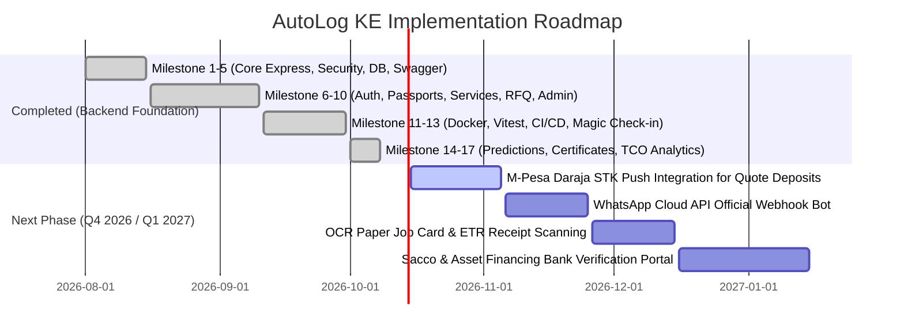

# 🛡️ System Loopholes, Fraud Defenses & Implementation Roadmap — AutoLog KE

This document provides a **deep-dive architectural analysis of every automotive attack vector, market loophole, cryptographic countermeasure, and mathematical model** implemented in AutoLog KE, alongside the **future rollout roadmap**.

---

## 1. Deep Dive: The 14 System Loopholes & Countermeasures

| # | Attack Vector / Loophole | The Real-World Kenyan Danger | AutoLog Technical Countermeasure & Implementation |
|---|---|---|---|
| **1** | **Clocked Odometers (Clocking)** | Sellers rewind analog or digital meters by 50,000 km before listing on Jiji or Facebook Marketplace. | **Mathematical Monotonicity Guard:** In `Vehicle.ts` and `vehicle.controller.ts`, every update enforces $\text{newMileage} \ge \text{currentMileage}$. Decreasing mileage returns HTTP `400 Bad Request` with an `ODOMETER_ROLLBACK_DETECTED` security flag. |
| **2** | **Fabricated Pre-Sale Service Logs** | Sellers fabricate 5 years of fake maintenance logs right before selling their car. | **30-Day Backdating Audit Detector:** Pre-save middleware on `ServiceRecord` checks if $\text{serviceDate} < (\text{entryDate} - 30\text{ days})$. If true, it automatically sets `isBackdated: true`, permanently stamping a **"⚠️ Historic Backdated Entry"** warning on the public passport. |
| **3** | **Vehicle Tracking & Hijacking via Plate Scraping** | Criminals use public vehicle plates and chassis numbers to track owner residence and schedule carjackings. | **Strict Public Privacy Shield:** The public endpoint `GET /api/v1/vehicles/passport/:slug` masks plates (`KDA 123A` $\to$ `KD* ***A`) and chassis (`...5161`). Personal names, phones, and addresses are strictly omitted from public JSON responses. |
| **4** | **Informal Mechanics Without Laptops / Apps** | Over 80% of Nairobi fundis (Grogan, Ngara) use grease-stained paper receipt books and don't want an app. | **Zero-Friction Paper-to-Digital Bridge:** The fundi does not need an account. The owner takes a phone camera snapshot of the paper job card, which is uploaded to Cloudinary as a **Tier 2 Documented Entry**. |
| **5** | **Kirinyaga Road Bait-and-Switch Pricing** | A dealer quotes KES 4,500 over WhatsApp, but when the motorist arrives in town, demands KES 7,000 claiming "dollar rates changed". | **Cryptographic 48-Hour Price Lock:** Quotes submitted on an RFQ automatically record `validUntil = createdAt + 48 hours`. Dealers who fail to honor locked prices suffer account de-listing and reputation penalty. |
| **6** | **Kirinyaga Road Price Fixing & Cartels** | Parts dealers communicate in WhatsApp groups to artificially inflate quotes on specific parts. | **Blind Bidding Reverse Auction:** Dealers can view open RFQs but are cryptographically prevented from viewing competing quotes submitted by other shops. Only the car owner sees the ranked bidding feed. |
| **7** | **Rogue Garage Self-Accreditation Fraud** | A dishonest repair shop registers and marks its own entries as "Verified Partner" to deceive used-car buyers. | **Admin Accreditation Gate:** Commercial users cannot edit `isVerifiedPartner`. Only platform administrators can verify a garage via `POST /api/v1/admin/garages/:id/verify` after physical inspection and business registration verification. |
| **8** | **Suspended Dealer Rogue Session Abuse** | A banned dealer continues selling counterfeit parts using an existing, non-expired JWT token. | **Instant Token Invalidation:** The `protect` middleware queries `User.findById` on every single authenticated request, checking `user.isSuspended`. If true, it terminates the request immediately with HTTP `403 Forbidden`. |
| **9** | **Privilege Escalation during Registration** | Malicious users send `{ "role": "admin" }` in the registration payload to gain superuser permissions. | **Zod Whitelist Sanitizer & CLI Seed Gate:** Public registration schemas explicitly whitelist only `['owner', 'garage', 'dealer']`. Admin accounts can only be provisioned via secure terminal execution (`npm run seed:admin`). |
| **10** | **Motorist Laziness & Forgetting to Log** | Drivers forget to track mileage, rendering digital passports stale and incomplete. | **Automated Sunday Magic Links:** The cron daemon sends a signed 72-hour JWT link (`https://autolog.ke/checkin?token=...`) every Sunday at 18:00 EAT. Motorists tap and slide their odometer in 5 seconds with zero passwords. |
| **11** | **Chicken-and-Egg Marketplace Dilemma** | If parts dealers aren't active yet, car owners abandon the app. | **Single-Player Utility Strategy:** The platform provides 100% utility to car owners immediately for maintenance tracking, fuel/cost analytics, and resale verification, even with zero parts dealers online. |
| **12** | **Driver Notification Fatigue & Spam** | Frequent automated check-in messages annoy drivers, causing them to block the service. | **Anti-Spam Idempotency Guard:** Scans enforce `lastCheckinPromptSentAt <= 7 days ago`. Drivers are mathematically prevented from receiving more than one check-in prompt per week. |
| **13** | **Multi-Category Invoice Double Counting** | Combined invoices (e.g. Brakes + Suspension for KES 22,500) cause MongoDB `$unwind` to count 22,500 twice, inflating total expenses to 175%. | **Proportional Cost Allocation Engine:** In `analytics.controller.ts`, `$addFields` divides `costKes` by `{ $size: '$serviceType' }` before unwinding. Category expenses and percentages now sum up to exactly 100%. |
| **14** | **Handover Certificate PDF Forgery** | Dishonest sellers fabricate a printed PDF handover certificate claiming genuine service history. | **Deterministic SHA-256 Fingerprinting:** Certificates carry a 64-character hash combining plate, current mileage, total service count, tier 3 partner count, and issuance timestamp. Any altered mileage or fabricated log invalidates the hash when checked against `autolog.ke/passport/:slug/certificate`. |

---

## 2. Mathematical & Cryptographic Models

### 2.1 The Dynamic Daily Burn Rate Algorithm
Car owners don't drive equal distances every day. AutoLog KE dynamically recalibrates daily consumption based on real intervals:

$$\text{estDailyKm} = \max\left(10, \min\left(250, \frac{\text{CurrentMileage} - \text{InitialMileage}}{\Delta \text{DaysElapsed}}\right)\right)$$

- **Default baseline:** $35\text{ km/day}$ (Nairobi commuter standard).
- **Upper/Lower bounds:** Clamped between $10\text{ km/day}$ and $250\text{ km/day}$ to prevent rogue anomalies from single long-distance trips (e.g. Nairobi to Mombasa).

### 2.2 Deterministic SHA-256 Certificate Fingerprint
The handover certificate verification hash is calculated deterministically:

$$\text{Hash} = \text{SHA256}(\text{Plate} : \text{CurrentMileage} : \text{TotalServices} : \text{Tier3Count} : \text{IssuedAt} : \text{"AUTOLOG\_KE\_TAMPER\_PROOF"})$$

**Verification Invariant:**
- If any service record is deleted, added, or backdated after issuance, or if the odometer is modified, the hash cannot be reproduced.
- The public serial number is constructed as:
  $$\text{Serial} = \text{"AL-KE-" } + \text{Year} + \text{"-" } + \text{Make (5 chars)} + \text{"-" } + \text{Hash[:4].toUpperCase()}$$
  *(e.g., `AL-KE-2026-MAZDA-DC8F`)*

---

## 3. Implementation Roadmap & Milestones

### Future Phases:
1. **M-Pesa Daraja API Integration (Phase 2):**
   - Enables car owners to deposit a commitment fee (e.g., KES 500) via M-Pesa STK Push when accepting a quote, held in escrow until parts inspection at Kirinyaga Road.
2. **Official WhatsApp Cloud API Webhook (Phase 2):**
   - Replaces manual SMS links with an interactive WhatsApp bot where drivers reply with their mileage directly in chat.
3. **OCR Engine for Handwritten Job Cards (Phase 3):**
   - Uses machine learning OCR to automatically extract mileage, date, and part names from photos of handwritten Kenyan fundi job cards.
